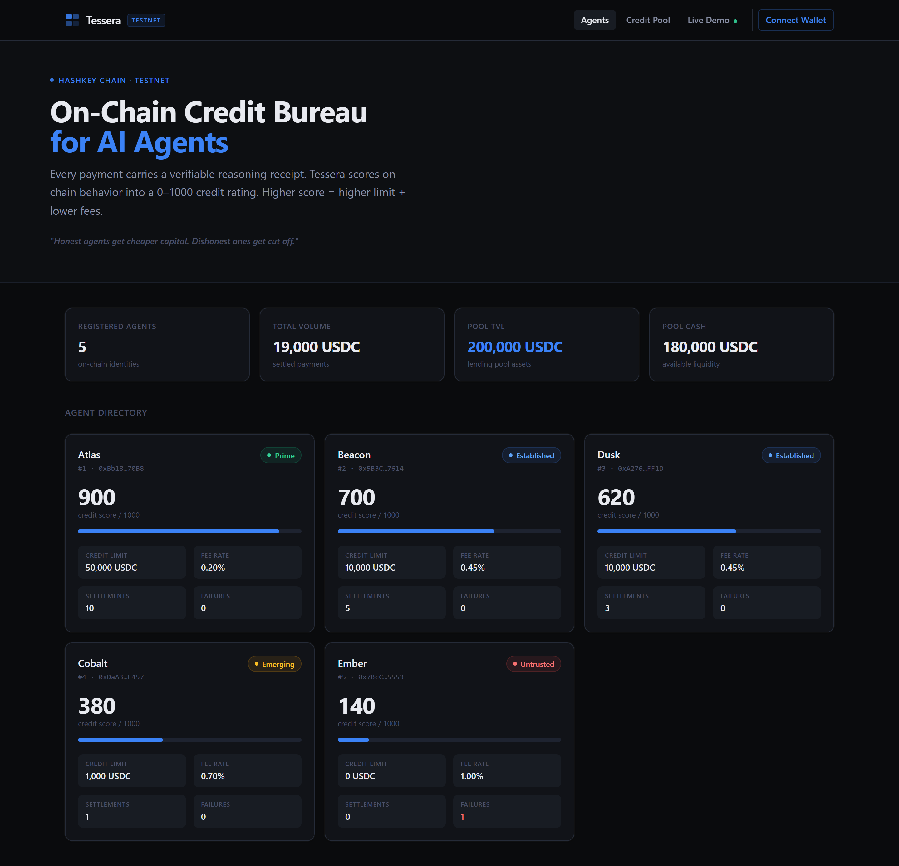
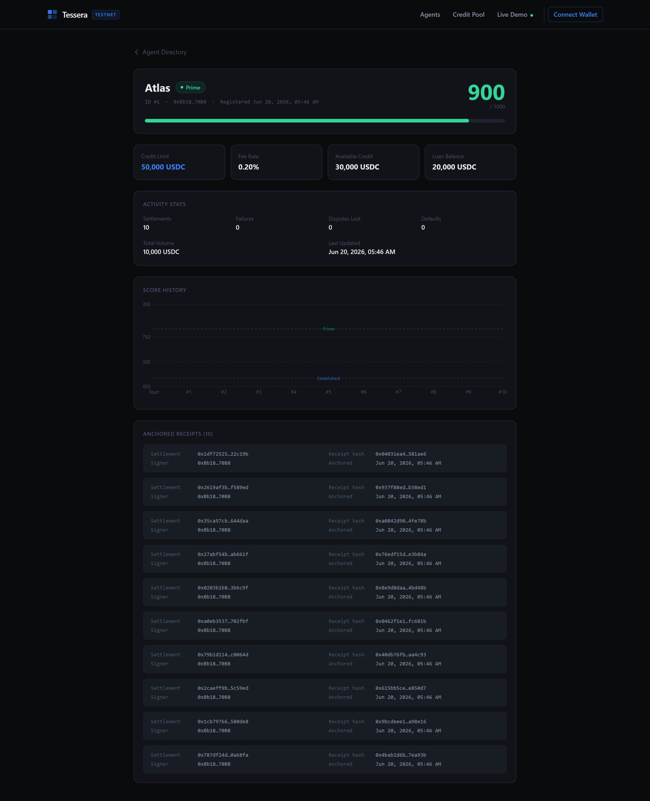
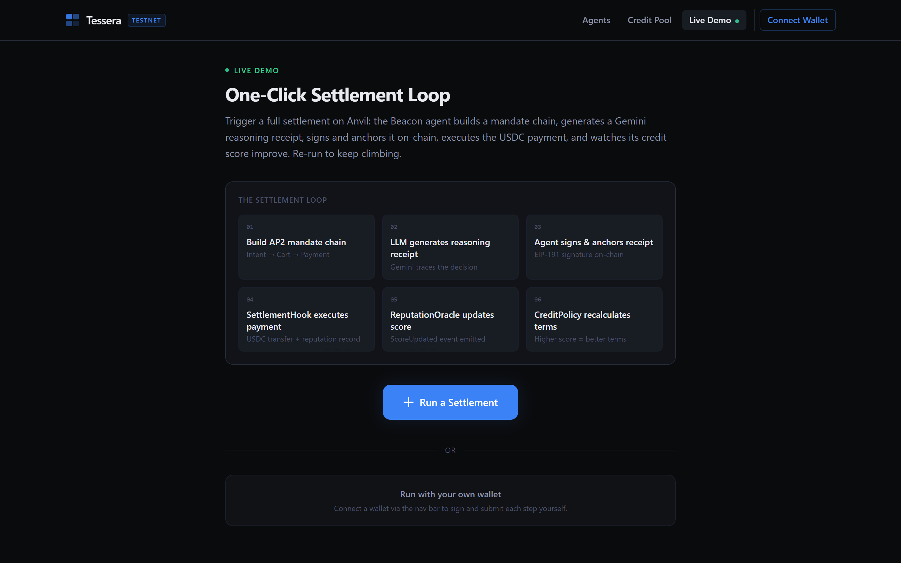
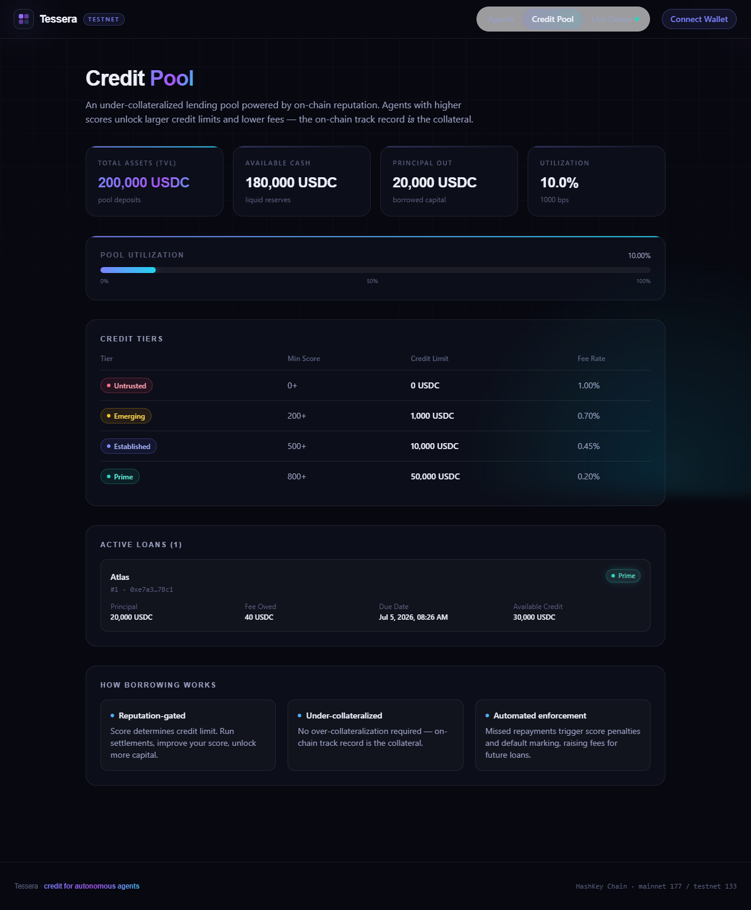

# Tessera

**An on-chain credit bureau for AI agents on HashKey Chain.**

Every time an AI agent settles a payment, it must attach a verifiable *reasoning receipt*. Tessera scores
the agent's on-chain behavior into a 0–1000 credit rating, and that rating unlocks higher credit limits
and lower fees — then turns reputation into a real **under-collateralized lending** primitive.

> **Honest agents get cheaper capital. Dishonest ones get cut off.**

---

## Screenshots

▶️ **Demo video (90s, narrated + captioned):** [`docs/tessera-demo.mp4`](docs/tessera-demo.mp4) — a recorded walkthrough of the live loop: settle → reasoning receipt anchored → score updates on-chain → credit terms improve.

| Agent directory | Agent detail — score history + anchored receipts |
|---|---|
|  |  |
| **Live demo — one-click settlement loop** | **Credit pool — reputation-backed lending** |
|  |  |

---

## Live on HashKey Chain

Deployed and **source-verified** on HashKey Chain — click any address for the verified source on Blockscout.

**Mainnet** (chainId 177, explorer [hashkey.blockscout.com](https://hashkey.blockscout.com)) — wired to the **official HashKey USDC**:

| Contract | Address (verified) |
|---|---|
| AgentRegistry | [`0x0260…b893`](https://hashkey.blockscout.com/address/0x0260fA01254CB8747F9D4b754Dc940CFcF59b893?tab=contract) |
| ReceiptVerifier | [`0x4317…cF7B`](https://hashkey.blockscout.com/address/0x4317692a9fDd7004C3c5c9042034181B9100cF7B?tab=contract) |
| ReputationOracle | [`0x6A90…325A`](https://hashkey.blockscout.com/address/0x6A9064BB1B22671b6D6Fa01496d3e8432f70325A?tab=contract) |
| CreditPolicy | [`0xbeaf…E70C`](https://hashkey.blockscout.com/address/0xbeaf88Ac02152C03103fa8bD4df41D96fC2aE70C?tab=contract) |
| SettlementHook | [`0x03Ec…CB66`](https://hashkey.blockscout.com/address/0x03Ec5f56336CbE7ee18f77027ea9223d00AdCB66?tab=contract) |
| CreditLine | [`0xcE2c…429B`](https://hashkey.blockscout.com/address/0xcE2c673072dd3CE1De7F850B3Eb5e6499978429B?tab=contract) |
| USDC (official) | [`0x054e…D88D0a`](https://hashkey.blockscout.com/address/0x054ed45810DbBAb8B27668922D110669c9D88D0a) |

The full mainnet deploy + verification of all 6 contracts cost **≈ 0.0009 HSK (well under one cent)**.

**Testnet** (chainId 133, explorer [testnet-explorer.hsk.xyz](https://testnet-explorer.hsk.xyz)) — used for the
interactive demo; seeded with 5 agents across all tiers (Atlas 900 · Beacon 700 · Dusk 620 · Cobalt 380 ·
Ember 140), a 200k-USDC lending pool, and a live 20k under-collateralized credit draw. Addresses in
[`contracts/deployments/133.json`](contracts/deployments/133.json) (also all verified on Blockscout).

---

## Why this matters

HashKey's **White Paper 2.0** frames the AI-agent roadmap as three layers: **identity + credit + assets**
(ZKID + a credit/reputation mechanism + the HashKey Settlement Protocol, HSP). The *identity* (ZK) layer was
saturated by prior hackathon winners. The **credit/reputation** layer is the open gap.

Tessera fills that gap:
- it **uses HSP** for settlement (the DeFi-track integration), and
- it turns the resulting reputation into **under-collateralized credit** — the DeFi×AI crossover.

North-star demo: **trigger a settlement → score moves → credit terms (limit + fee) visibly improve.**

## How it works

```
AI Agent (off-chain, TypeScript)
  1. builds an AP2 mandate chain (Intent → Cart → Payment) → derives a deterministic settlementId
  2. Gemini produces a structured reasoning trace for the payment decision
  3. full trace stored off-chain (Irys/IPFS) → receiptHash = keccak256(trace)
  4. agent controller signs receiptHash (ECDSA)
        │
        ▼
  ReceiptVerifier.anchorReceipt(...)      verifies the controller signature, anchors the hash
        │
        ▼
  SettlementHook.settle(...)              requires a verified receipt → stablecoin transfer (mock HSP)
        │                                  └── single documented SWAP POINT to the real HSP call
        ▼
  ReputationOracle.recordSettlement(...)  transparent 0–1000 score (rewards receipts, punishes fraud/default)
        │
        ▼
  CreditPolicy.terms(score) → (creditLimit, feeBps)     higher score ⇒ higher limit + lower fee
        │
        ▼
  CreditLine                              reputation-backed under-collateralized lending pool
        │
        ▼
  Next.js dashboard                       directory · score-over-time · receipts · live settle→score→terms demo
```

Full design, distilled HashKey facts, the AP2 mandate shapes, scoring constants, and the HSP swap point:
see [`docs/ARCHITECTURE.md`](docs/ARCHITECTURE.md). Judge-video storyboard: [`docs/DEMO.md`](docs/DEMO.md).

## Contracts

| Contract | Role |
|---|---|
| `AgentRegistry` | Registers agents (controller + metadata); keys by incremental `agentId`. |
| `ReceiptVerifier` | Anchors a reasoning-receipt hash per settlement, gated by the controller's ECDSA signature. |
| `ReputationOracle` | Transparent 0–1000 credit score; rewards receipted/on-time settlements, penalizes failures, disputes, defaults; mild decay. Only authorized recorders may write. |
| `CreditPolicy` | Pure `terms(score) → (creditLimit, feeBps)` over owner-configurable tiers. |
| `SettlementHook` | Mock HSP settlement: requires a verified receipt, transfers stablecoin, records reputation. Heavily-commented swap point to real HSP. |
| `CreditLine` | Reputation-backed under-collateralized pool: LPs earn fees; agents borrow up to their limit; defaults slash score. |
| `mocks/MockUSDC` | Testnet 6-decimal faucet token. Mainnet uses the official HashKey USDC. |

Default credit tiers: `<200` → $0 @ 1.00% · `200–499` → $1k @ 0.70% · `500–799` → $10k @ 0.45% · `≥800` → $50k @ 0.20%.

## Repo layout

```
contracts/   Foundry: src/ (7 contracts), test/ (50 tests), script/Deploy.s.sol, deployments/
agent/       TypeScript service: AP2 mandates, Gemini receipts, settlement, multi-agent simulator
web/         Next.js 15 dashboard (App Router, Tailwind, Recharts)
docs/        ARCHITECTURE.md, DEMO.md
scripts/     extract-abis.mjs (generates typed ABIs for agent + web)
```

## Prerequisites

- Node ≥ 20 and **pnpm** (`npm i -g pnpm`)
- **Foundry** (`curl -L https://foundry.paradigm.xyz | bash && foundryup`)

## Setup

```bash
pnpm install
cd contracts && forge build && forge test   # 50 tests should pass
cd .. && node scripts/extract-abis.mjs       # refresh typed ABIs (only needed after contract changes)
cp .env.example .env                         # then fill in values (never commit .env)
```

## Run the full demo locally (anvil)

```bash
# terminal A — local chain
anvil

# terminal B
export DEPLOYER_PRIVATE_KEY=0xac0974bec39a17e36ba4a6b4d238ff944bacb478cbed5efcae784d7bf4f2ff80  # anvil acct 0
cd contracts && forge script script/Deploy.s.sol --rpc-url http://127.0.0.1:8545 --broadcast && cd ..
CHAIN_ID=31337 RPC_URL=http://127.0.0.1:8545 pnpm agent:simulate   # seeds 5 agents + LP + a credit draw
NEXT_PUBLIC_CHAIN_ID=31337 NEXT_PUBLIC_RPC_URL=http://127.0.0.1:8545 pnpm web:dev   # http://localhost:3000
```

`agent:simulate` seeds agents across every tier (≈ Atlas 900, Beacon 700, Dusk 620, Cobalt 380, Ember 140).

## Deploy to HashKey testnet

**Fast path:** fund the burner + fill `.env`, then `powershell -File scripts/deploy-hashkey.ps1` (deploys +
verifies + seeds demo agents). Full checklist + troubleshooting: [`docs/deployment-guide.md`](docs/deployment-guide.md). Manual steps:

1. Fund your burner with testnet HSK from the faucet: `https://faucet.hsk.xyz/faucet`.
2. In `.env` set `DEPLOYER_PRIVATE_KEY` and `HSK_TESTNET_RPC=https://testnet.hsk.xyz`.
3. Deploy (MockUSDC is deployed automatically on non-mainnet):

```bash
cd contracts
forge script script/Deploy.s.sol --rpc-url $HSK_TESTNET_RPC --broadcast \
  --verify --verifier blockscout --verifier-url https://testnet-explorer.hsk.xyz/api
cd ..
CHAIN_ID=133 pnpm agent:simulate
NEXT_PUBLIC_CHAIN_ID=133 pnpm web:dev
```

Addresses are written to `contracts/deployments/133.json` and read automatically by the agent + dashboard.

## Deploy to HashKey **mainnet** (the eligibility step — run last with real HSK)

Fund the burner with a few dollars of mainnet HSK, then:

```bash
cd contracts
forge script script/Deploy.s.sol --rpc-url https://mainnet.hsk.xyz --broadcast \
  --verify --verifier blockscout --verifier-url https://hashkey.blockscout.com/api
```

On mainnet (chainId **177**) the deploy script automatically wires the **official HashKey USDC**
(`0x054ed45810DbBAb8B27668922D110669c9D88D0a`) instead of MockUSDC. Addresses land in
`contracts/deployments/177.json`. The interactive demo is best run on testnet (MockUSDC faucet); the
mainnet deploy satisfies the hackathon's "contracts deployed on HashKey Chain mainnet" requirement.

## HSP integration & the swap point

HSP (built on Google's **AP2**) has no public on-chain ABI, and the hackathon does not require onboarding as
a licensed institution. So Tessera models the AP2 mandate flow off-chain (`agent/src/mandate.ts`) and uses a
**mock `SettlementHook`** on testnet. The single line to swap for the real HSP settlement is marked
`HSP SWAP POINT` in [`contracts/src/SettlementHook.sol`](contracts/src/SettlementHook.sol) — everything above
it (reputation, credit) is unchanged by the swap, because Tessera sits *above* settlement and only consumes
its success/failure signal.

## Tech stack

Foundry · Solidity 0.8.24 · OpenZeppelin v5 · TypeScript · viem · Gemini · Irys/IPFS · Next.js 15 · wagmi · Recharts · pnpm workspaces.

## Testing

```bash
cd contracts && forge test -vvv && forge snapshot
```

50 tests: per-contract units + an end-to-end integration test proving both the honest-agent (earns better
terms + draws credit) and dishonest-agent (cut off) paths. Scoring math is intentionally simple and auditable.

## Security notes

- Reputation scoring + credit logic are transparent, OpenZeppelin-based, and NatSpec'd — no clever unaudited math.
- Score mutations are restricted to authorized recorder contracts; tier config is owner-gated.
- Hardened after an internal review: the lending pool uses **internal cash accounting** (a direct token
  donation cannot inflate share price — neutralizes the ERC4626 first-depositor attack); repayment only
  rewards reputation above a minimum loan size (no dust-loop score farming) and is a secondary signal to
  receipted settlements; a loan top-up cannot reset an overdue due date. Covered by dedicated tests.
- Known, accepted limitations for the demo model: receipt signatures are bound to the agent + settlement
  via the hashed trace contents (no separate EIP-712 domain); the settlement coordinator (owner) relays
  failure/dispute outcomes that, in production, come from HSP/arbitration.
- EAS (Ethereum Attestation Service) was evaluated for receipt attestation but is **not deployed on HashKey
  Chain**, so `ReceiptVerifier` serves as Tessera's native on-chain attestation registry (signed receipt
  hash); an EAS adapter can be wired in if/when EAS launches on HashKey.
- No secrets are committed; `.env` is gitignored — only `.env.example` is tracked. Use a fresh burner key for deploys.

## License

MIT.
